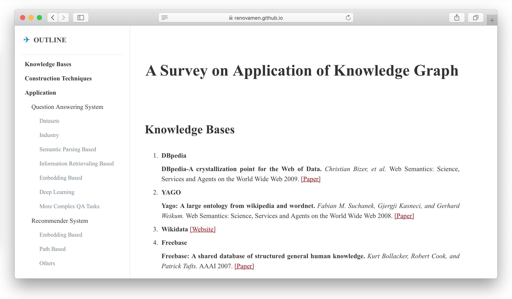

# Outline for Typora

Generate navigation sidebar for HTML exported from Markdown by [Typora](https://typora.io/). Inspired by [markdown_nav](https://github.com/chris-peng/markdown_nav).

&nbsp;

## Preview

[Example](https://renovamen.github.io/KG-Application-Papers/):



&nbsp;

## Usage

### Typora

Download this repository and include following files in your Markdown:

```javascript
<script type="text/javascript" src="https://cdn.bootcss.com/jquery/3.4.1/jquery.min.js"></script>
<script type="text/javascript" src="outline/outline.js"></script>
<link rel="stylesheet" type="text/css" href="outline/outline.css">
```

Modify your site icon in `outline.js`:

```js
var ico_link = "<link rel=icon type=image/png href=example.ico>";
```

Then use Typora to export the Markdown into HTML.

Note: It performs heading 2 to 4 only.

&nbsp;

### Common HTML

Include above-mentioned files and contain your content in `<div id='write'></div>`:

```html
<body>
    <div id='write'>
        <h1>Heading 1</h1>
        <h2>Heading 2</h2>
        <!--- ...... --->
    </div>
</body>
```